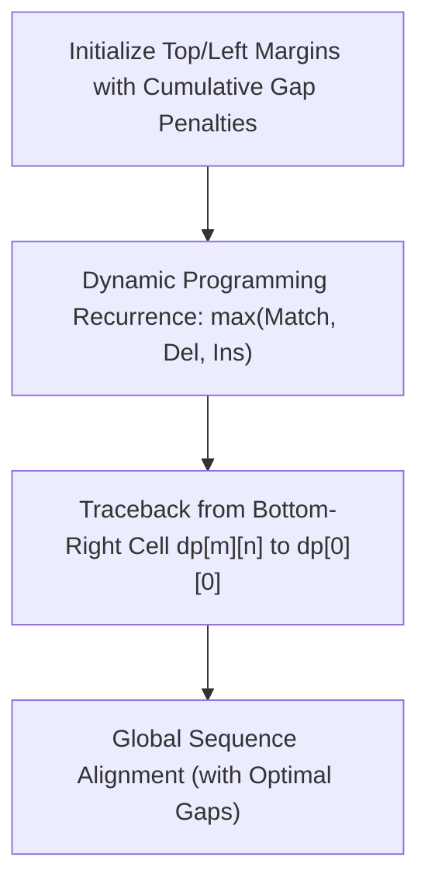

# Needleman-Wunsch Global Sequence Alignment Skill

Dynamic programming formulation for rigorous end-to-end global alignment of nucleotide and amino acid sequences.

## Features
- **100% Python Standard Library**: Zero third-party dependencies.
- **Global Optimality Guarantee**: Finds true mathematical optimum alignment.
- **Full Traceback Path**: Complete reconstruction of aligned character strings.
