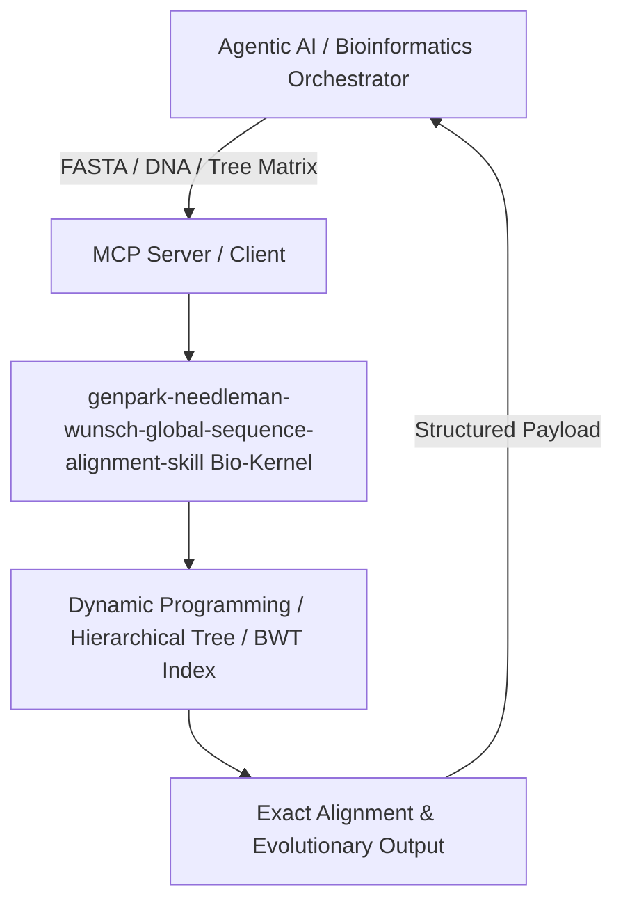

# genpark-needleman-wunsch-global-sequence-alignment-skill

[](https://github.com/alphaparkinc/genpark-needleman-wunsch-global-sequence-alignment-skill)
[](https://python.org)
[](#)
[](#)
[](LICENSE)

> Needleman-Wunsch dynamic programming algorithm for optimal global pairwise alignment of nucleotide and amino acid sequences with customizable scoring matrices.

## Architecture Overview



## Features
- **0 External Pip Dependencies**: Pure Python standard library implementation.
- **MCP Protocol Ready**: Includes Model Context Protocol server script (`mcp_server.py`).
- **Production Standard**: Comprehensive biochemical test cases, ultra-fast DP matrices.

## Quick Start
```bash
python example_usage.py
```
